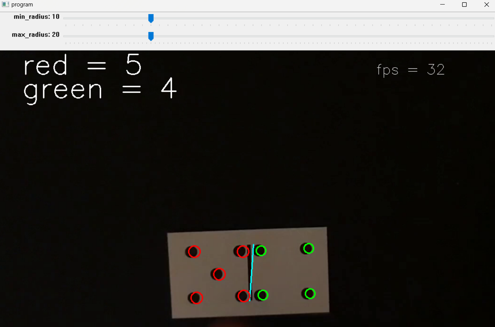

# domino-detector-with-opencv

this program is created to help detect the dominos from `Video_Dominosteine.mp4` . Every domino that has been detected will be stored in the `output.txt` file .

+  how to run : 

>  just run `prog.py` XD 

>  ok ok, sorry about that XD , but got ya XD ,  just `cd` into your working directory with your terminal then use the command `python prog.py` 

+ if program did not run it means you did not install the dependencies from `requirements.txt` using the command `pip install -r requirements.txt` in your terminal, (or i messed up somewhere in the code XD, if so please contact me to fix it ), or just do like me and sit in the corner and cry :')